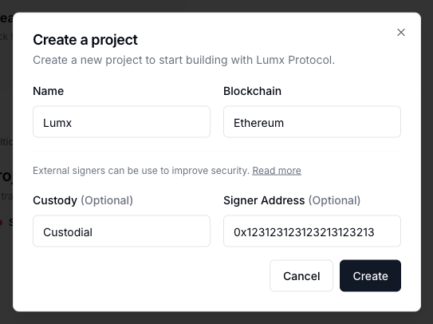

When using the custodial model, you have the freedom to use your own signing provider, including options like Fireblocks MPC, Google HSM, and others. This recipe explains how to encode a transaction using Lumx Protocol, sign it with your own provider, and submit it back to the Protocol to be executed on the blockchain.

<Warning>
  This recipe only applies for projects that use an external signer.
</Warning>

<Steps>
  <Step title="Create a custodial project">
    To create a custodial project, access the [dashboard](https://dashboard.lumx.io/) and choose custodial option when creating a project. In the signer field, use the public address of the wallet you will use to sign the transactions: 

    
    
  </Step>
  <Step title="Encode a transaction">

    Now, let's create an encoded transaction. We will be using the custom transaction example from the [previous guide](/guides/recipes/invoke-a-custom-transaction), but the process for creating mints or transfers would be the same.

    <Info>Remember to switch `<API_KEY>`, `<WALLET_ID>`, `<EXTERNAL_WALLET_ADDRESS>`.</Info>

<CodeGroup>

```bash cURL
    curl --request POST \
    --url https://protocol-sandbox.lumx.io/v2/transactions/custom \
    --header 'Authorization: Bearer <API_KEY>' \
    --header 'Content-Type: application/json' \
    --data '{
    "contractAddress": "0xa7Cb3EF2e19bCAA7C765370c39d7a06ea5595D08",
    "walletId": "<WALLET_ID>",
    "operations": [
        {
          "functionSignature": "generateRandomAirdrop(string)",
          "argumentsValues": [
              "randomStringValue"
          ]
        },
        {
          "functionSignature": "transfer(address, uint256)",
          "argumentsValues": [
              "<EXTERNAL_WALLET_ADDRESS>",
              "25644842301077323776"
          ]
        }
    ],
    }'
```

</CodeGroup>

    You will receive a status 201 with an object containing the transaction data, a "awaiting_signature" status, and a string under the key "encodedTxHash":
    
     ```
      {
        "encodedTxHash": <string>,
        "status": "awaiting_signature",
      }
    ```
    Save this string to use on the next step.

  </Step>
  <Step title="Sign the transaction">

  Now, you will need to sign the transaction using the secp256k1 elliptic curve. The exact implementation for this step will depend on which signing provider you're using, but we've included some examples below.

  <Tabs>
  <Tab title="Google Cloud HSM">
    <CodeGroup>
      ```bash cURL
      ```
      ```js JS
      ```
      ```python Python
      ```
    </CodeGroup>
  </Tab>
  <Tab title="Fireblocks">
    To use the following example, you must have a Fireblocks account with a [vault account](https://developers.fireblocks.com/reference/create-vault-account). Make sure to use the same vault account you used when creating the project on the first step.
    <Info>Remember to switch `<FIREBLOCKS_API_KEY>`, `<FIREBLOCKS_JWT_KEY>`, `<VAULT_ACCOUNT_ID>` and `<encodedTxHash>`.</Info>
    <CodeGroup>
      ```bash cURL
        curl --location 'https://sandbox-api.fireblocks.io/v1/transactions' \
        --header 'Content-Type: application/json' \
        --header 'Accept: application/json' \
        --header 'X-API-Key: <FIREBLOCKS_API_KEY>' \
        --header 'Authorization: Bearer <FIREBLOCKS_JWT_KEY>' \ 
        --data '{
          "operation": "RAW",
          "assetId": "AMOY_POLYGON_TEST",
          "source": {
            "type": "VAULT_ACCOUNT",
            "id": "<VAULT_ACCOUNT_ID>"
          },
          "extraParameters": {
            "rawMessageData": {
              "messages": [
                {
                  "content": "<encodedTxHash>"
                }
              ]
            }
          }
        }'
      ```
      ```js JS
      ```
      ```python Python
      ```
    </CodeGroup>
    You will receive a signature containing the fields `r`,`s`,`v` and `fullSig`. Save the `fullSig` string to use it on the next step.
  </Tab>
  <Tab title="AWS CloudHSM">
    The example below assume you already have deployed an AWS CloudHSM instance that is ready to create and manipulate keys. Follow [these steps](https://docs.aws.amazon.com/cloudhsm/latest/userguide/getting-started.html) to create the instance if needed. 
    <CodeGroup>
      ```bash cURL
      ```
      ```js JS
      ```
      ```python Python
      ```
    </CodeGroup>
  </Tab>
  <Tab title="BitGo">
    <CodeGroup>
      ```bash cURL
      ```
      ```js JS
      ```
      ```python Python
      ```
    </CodeGroup>
  </Tab>
</Tabs>

  </Step>
  <Step title="Execute the signed transaction">

  Now that you have the signed transaction, you're ready to submit it to the blockchain, using our [execute signed transaction](/api-reference/transactions/execute-signed-transaction) endpoint:

  ```bash cURL
    curl --request POST \
    --url https://protocol-sandbox.lumx.io/v2/transactions/:transactionId/execute \
    --header 'Authorization: Bearer <API_KEY>' \
    --header 'Content-Type: application/json' \
    --data '{"signedTransaction": "string"}'
```

  You will receive a status 202 indicating that the transaction has been accepted and will be submitted to the blockchain. This is an async action, meaning you will need to monitor the status of the transaction using the [read a transaction](/api-reference/transactions/read-a-transaction) endpoint. Alternatively, you can [register a webhook](/guides/recipes/register-a-webhook) to receive the transaction's result.

  </Step>
</Steps>

<Snippet file="troubleshooting.mdx" />
